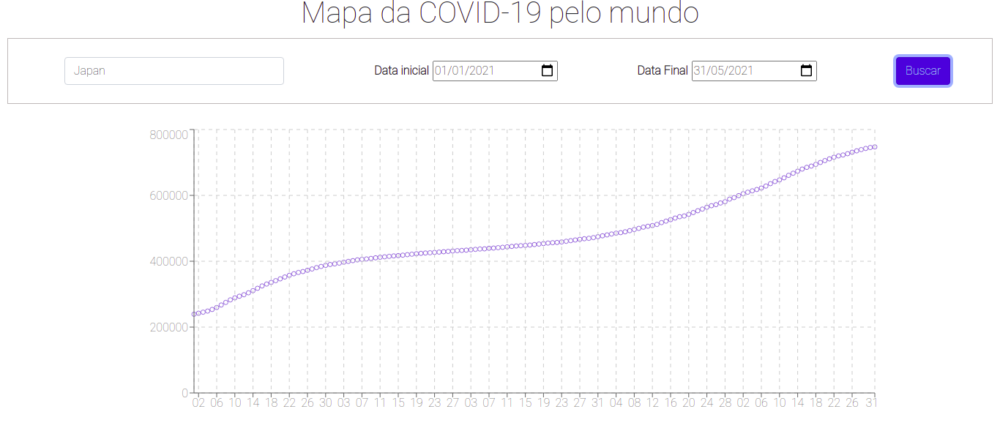

# Coronavírus App

Este projeto foi feito usando React, Bootstrap, e Recharts

## Para usar

Basta clonar o projeto, digitar npm install e depois npm start.

### Funcionalidades

Este app busca em tempo real através de requisisões fetch à API `https://api.covid19api.com/`, dados sobre o número de casos do coronavírus em todo o mundo.
O usuário pode escolher um país e selecionar o período que deseja visualizar, que o gráfico será montado na página.

### Como ficou

